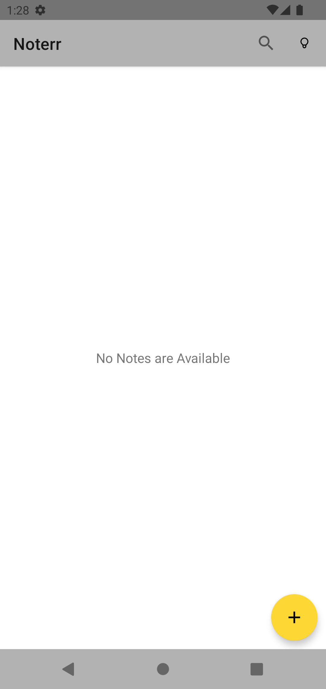
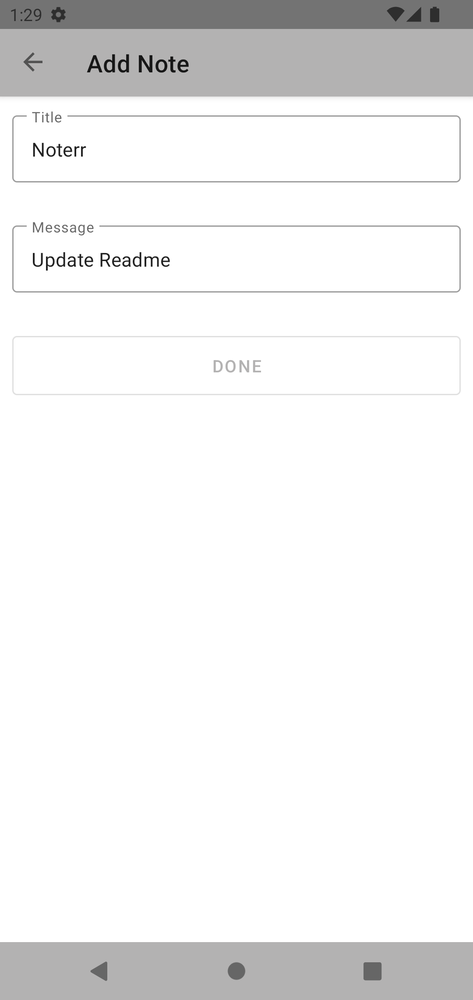
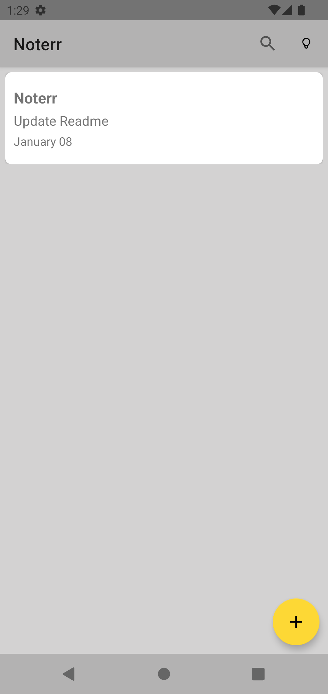
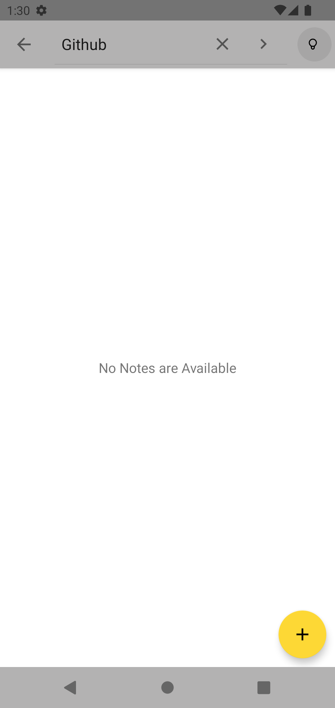
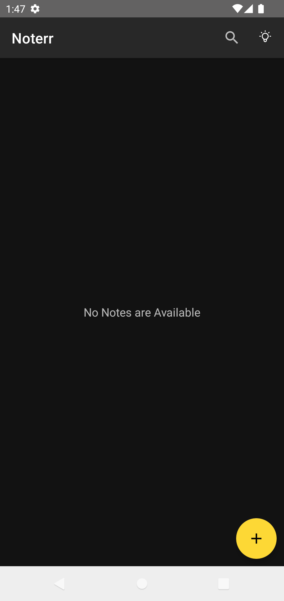
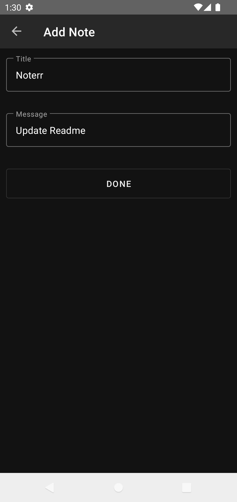
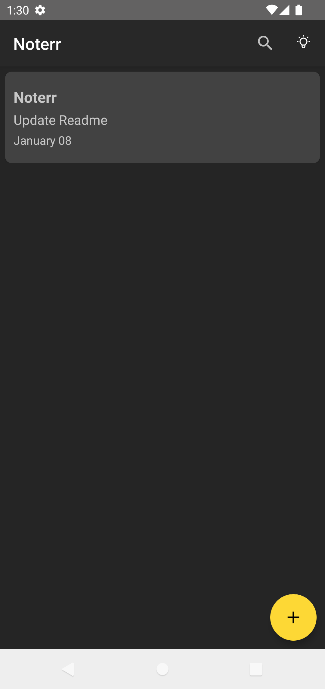
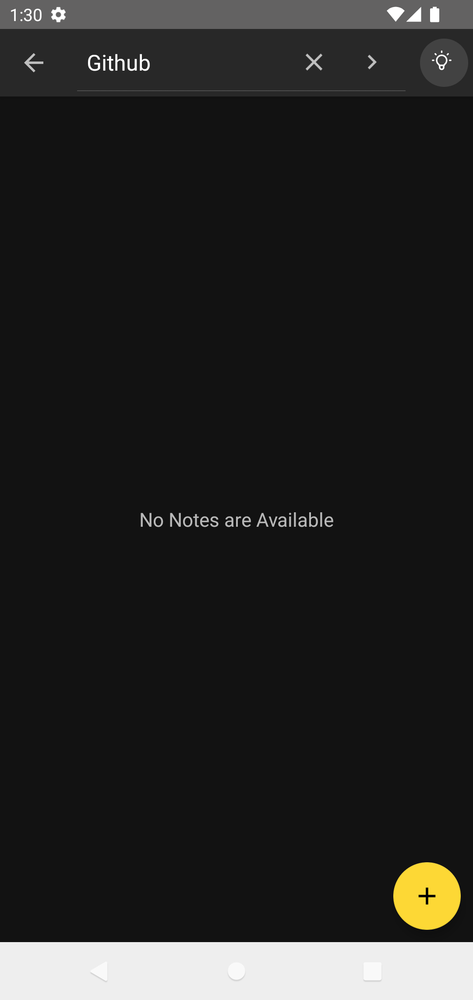

# Noterr 📓
Noterr is a Note-Taking app built with modern android components using MVVM architecture
- Add, Edit Notes
- Swipe for Delete
- Search Notes
- Supports Light and Dark Mode

## Preview
<table>
    <tr>
        <td>
            
        </td>
        <td>
            
        </td>
        <td>
            
        </td>
        <td>
            
        </td>
    </tr>
</table>
<table>
    <tr>
        <td>
            
        </td>
        <td>
            
        </td>
        <td>
            
        </td>
        <td>
            
        </td>
    </tr>

</table>

 

# Built with ⚙️
- [Kotlin](https://kotlinlang.org/)
- [Coroutines](https://kotlinlang.org/docs/reference/coroutines-overview.html)
- [Flow](https://kotlinlang.org/docs/reference/coroutines/flow.html)
- [StateFlow](https://developer.android.com/kotlin/flow/stateflow-and-sharedflow)
- [Room](https://developer.android.com/topic/libraries/architecture/room)
- [DataStore](https://developer.android.com/topic/libraries/architecture/datastore)
- [Jetpack Navigation](https://developer.android.com/guide/navigation)

 

### TODO
- [X] Add Screenshots
- [ ] Add Logo
- [ ] Add Snackbar on Delete
- [ ] Code Comments and update README

# Credits ❤️
- DarkMode/LightMode from [tablericons.com](https://tablericons.com)
- Check out [Expenso](https://github.com/Spikeysanju/Expenso), great app which demonstrates best practices.

 

## Contribute 🤝
Feel free to Contribute
